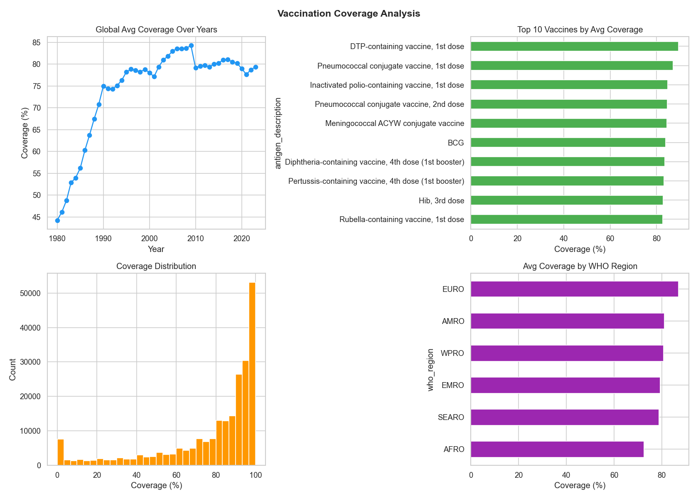
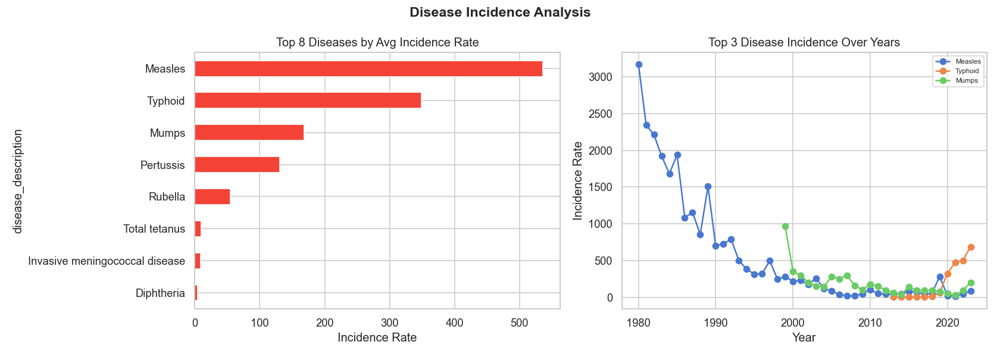
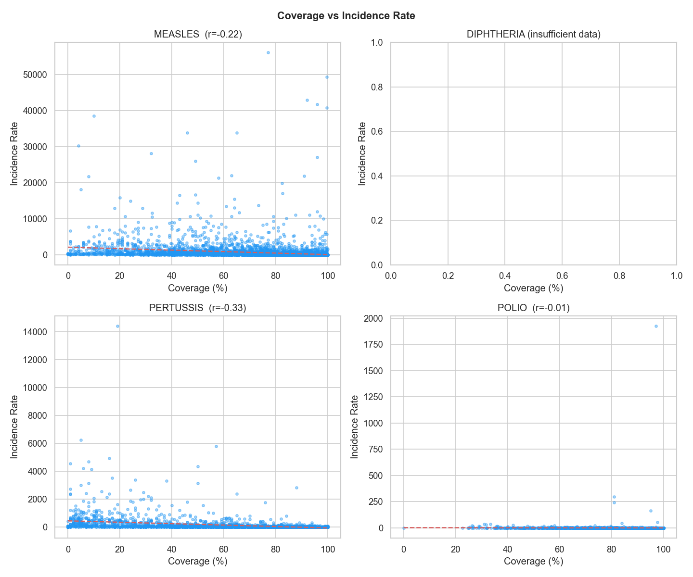
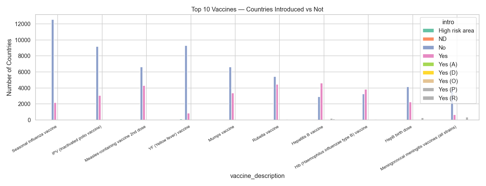

# 💉 Vaccination Data Analysis

> An end-to-end data analysis project on global WHO vaccination data using **Python**, **MySQL**, and **Power BI**.

---

## 📌 Project Overview

This project analyzes global vaccination trends, disease incidence rates, and vaccine effectiveness across 245 countries using WHO datasets. The complete pipeline covers data ingestion, cleaning, SQL storage, exploratory analysis, and interactive dashboards.

---

## 🗂️ Dataset

5 datasets sourced from **WHO (World Health Organization)**:

| File | Description |
|------|-------------|
| `coverage-data.xlsx` | Vaccination coverage % by country, year & antigen |
| `incidence-rate-data.xlsx` | Disease incidence rates per country per year |
| `reported-cases-data.xlsx` | Actual disease cases reported |
| `vaccine-introduction-data.xlsx` | Vaccine introduction status by country |
| `vaccine-schedule-data.xlsx` | Dose schedule & target population details |

---

## 🛠️ Tech Stack

| Tool | Purpose |
|------|---------|
| Python (pandas, numpy, matplotlib, seaborn) | Data cleaning & EDA |
| MySQL | Relational database storage |
| Power BI | Interactive dashboards |
| Git & GitHub | Version control |

---

## 🔄 Project Pipeline

```
Raw WHO Data (.xlsx)
       ↓
Python Data Cleaning
       ↓
MySQL Database (vaccination_db)
       ↓
EDA — Python Charts
       ↓
Power BI Dashboards
```

---

## 🧹 Data Cleaning (Python)

**File:** `data_cleaning.py`

Key cleaning steps applied to all 5 datasets:
- Removed missing values using `dropna`
- Type conversion using `pd.to_numeric` with error handling
- Clipped coverage values between 0–100%
- Removed duplicates using `drop_duplicates`
- Renamed and standardized column names

**Results after cleaning:**
| Table | Rows |
|-------|------|
| coverage_data | 3,99,858 |
| incidence_rate_data | 84,945 |
| reported_cases_data | 84,869 |
| vaccine_introduction_data | 1,38,320 |
| vaccine_schedule_data | 8,052 |

---

## 🗄️ MySQL Database

**File:** `data_cleaning_mysql.py`

- Database: `vaccination_db`
- 5 normalized tables created with proper data types
- Data loaded using `mysql-connector-python`

```sql
SHOW TABLES;
-- coverage_data
-- incidence_rate_data
-- reported_cases_data
-- vaccine_introduction_data
-- vaccine_schedule_data
```

---

## 📊 EDA — Python Charts

**File:** `eda.py`

### Chart 1 — Coverage Analysis


> Global vaccination coverage trend, top 10 vaccines, coverage distribution, and WHO region comparison.

---

### Chart 2 — Disease Incidence


> Top 8 diseases by incidence rate and their trends over the years.

---

### Chart 3 — Coverage vs Incidence Correlation


> Scatter plots showing negative correlation between vaccination coverage and disease incidence for Measles, Diphtheria, Pertussis, and Polio.

---

### Chart 4 — Vaccine Introduction


> Country-wise vaccine introduction status for top 10 vaccines globally.

---

## 📈 Power BI Dashboards

**File:** `Vaccination_Analysis.pbix`

7 interactive pages built in Power BI:

| Page | Description |
|------|-------------|
| Coverage Overview | Global coverage trend over years |
| Regional Analysis | Coverage comparison across 6 WHO regions |
| Coverage Vs Disease | Scatter plot — coverage vs incidence rate |
| KPI Dashboard | Avg coverage: 77.61% \| Cases: 293M \| Countries: 245 |
| Disease Analysis | Top diseases by incidence + year trends |
| Vaccine Introduction | Country-wise introduction status |
| Geographic Map | World map — coverage bubble by country |

---

## 🔑 Key Insights

- 🌍 **245 countries** analyzed across all WHO regions
- 💉 Global average vaccination coverage: **77.61%**
- 📉 Strong **negative correlation** between coverage and disease incidence
- 🦠 **293 Million** total reported disease cases in dataset
- 📈 Coverage has **improved significantly** over the years globally
- 🌐 EURO and WPRO regions show **highest coverage rates**

---

## ▶️ How to Run

```bash
# 1. Install dependencies
pip install pandas numpy matplotlib seaborn openpyxl mysql-connector-python

# 2. Clean data + save CSVs
python data_cleaning.py

# 3. Load into MySQL (update password in script)
python data_cleaning_mysql.py

# 4. Run EDA charts
python eda.py

# 5. Open Power BI dashboard
# Open Vaccination_Analysis.pbix in Power BI Desktop
```

---

## 👩‍💻 Author

**Muskan Gupta**  
AI/ML Intern — Innovexix  
GitHub: [@muskan-gupta02](https://github.com/muskan-gupta02)
